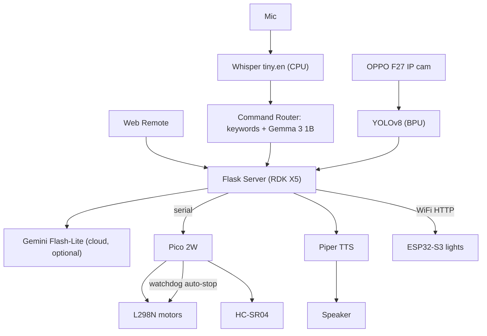

# Sahayak — System Architecture

Version 1.0 · 2026-07-07

## Challenge 2 — AI System Architecture

### System flow

### Module design

| Module | Responsibility | Failure handling |

|---|---|---|

| Flask server | orchestrates features, serves remote | auto-restart via systemd |

| Vision | YOLOv8 BPU inference | empty list on camera fail |

| STT | Whisper transcription | "did not hear" on empty |

| Router | map command to action | keyword fallback if Gemma unsure |

| Motor bridge (Pico) | drive + sensors | watchdog auto-stop < 0.6 s |

| TTS | speak responses | log error, continue |

| Home control (ESP32) | switch lights | independent node |

### Compute allocation

| Workload | Runs on | Utilisation |

|---|---|---|

| YOLOv8 | BPU | ~1 inference / 174 ms |

| Whisper / Piper | CPU | burst |

| Gemma 3 1B | CPU | ~3 s per routed command |

| Flask + I/O | CPU | continuous, light |

| Gemini | cloud | only on online request |

### Real-time note

The drive-keepalive (re-send every 0.3 s) must stay under the Pico's 0.6 s watchdog timeout: smooth motion when connected, guaranteed stop when not.

## v1.0-demo — New Features (2026-07-12)

Features added for the Stage 3 launch build, all additive to the architecture above:

### Pico serial auto-reconnect (failure recovery)

Motor EMI can drop the Pico's USB connection mid-drive. In addition to the

firmware safety watchdog (motors auto-stop 0.6 s after losing commands), the

Flask server now detects a failed serial write, closes the dead handle, and

re-detects/re-opens the port on the next command (handling `ttyACM0` →

`ttyACM1` re-enumeration). The system recovers without a restart. See RISKS.md.

### Ultrasonic + YOLO distance fusion

`/api/scan` fuses the HC-SR04 nearest-distance reading with YOLO detections to

report e.g. "I can see person, and the nearest object is about 0.6 meters

ahead." The ultrasonic reports one forward-cone distance (nearest obstacle),

paired with the full YOLO label set — not per-object depth.

### Explore mode

Rotates the robot in ~10 steps (reusing the Check-Room sweep), collects objects

with the distance at first sighting, then announces them one by one with pauses.

Registered in the standard mode system (start/stop/safety inherited).

### Offline conversational persona (Gemma 3 1B)

`gemma_chat()` provides warm, companion-style replies for non-command speech,

separate from the strict `gemma_route()` command classifier. Keyword-first

routing sends commands to actions and everything else to conversation.

Gemma runs as a systemd service (`gemma.service`) pinned to cores 0-4.

### Hands-free mode (wake-word loop)

One button press greets the user and starts a continuous turn-based listen loop.

It acts only when the wake word ("IrisBot") is heard, reusing the shared

`dispatch_action()` for both commands and chat. Stops via panel button. Offline.

### ROS 2 detection node graph

Real ROS 2 (Humble) nodes publish/subscribe BPU YOLO detections on

`/sahayak/detections`. See docs/ROS2_HYBRID.md and ros2/ROS2_EVIDENCE.txt for

the design rationale and verified live output.

