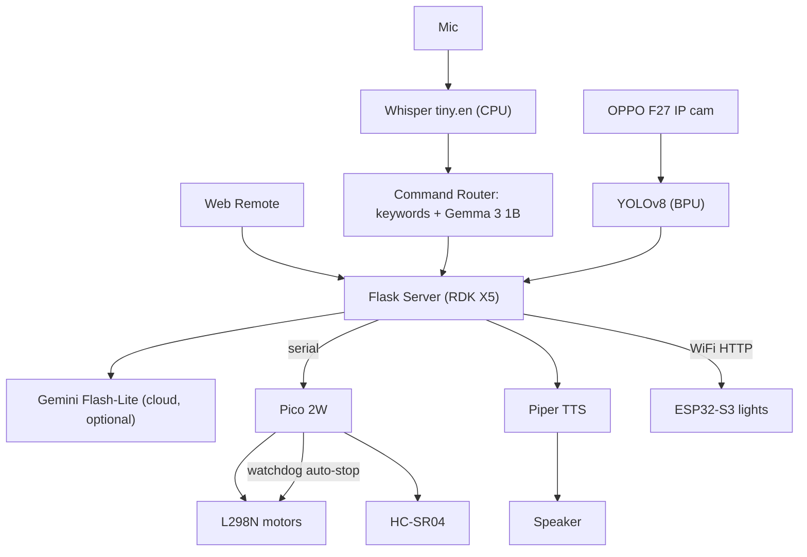

# Sahayak — System Architecture

Version 1.0 · 2026-07-07

## Challenge 2 — AI System Architecture

### System flow

### Module design

| Module | Responsibility | Failure handling |

|---|---|---|

| Flask server | orchestrates features, serves remote | auto-restart via systemd |

| Vision | YOLOv8 BPU inference | empty list on camera fail |

| STT | Whisper transcription | "did not hear" on empty |

| Router | map command to action | keyword fallback if Gemma unsure |

| Motor bridge (Pico) | drive + sensors | watchdog auto-stop < 0.6 s |

| TTS | speak responses | log error, continue |

| Home control (ESP32) | switch lights | independent node |

### Compute allocation

| Workload | Runs on | Utilisation |

|---|---|---|

| YOLOv8 | BPU | ~1 inference / 174 ms |

| Whisper / Piper | CPU | burst |

| Gemma 3 1B | CPU | ~3 s per routed command |

| Flask + I/O | CPU | continuous, light |

| Gemini | cloud | only on online request |

### Real-time note

The drive-keepalive (re-send every 0.3 s) must stay under the Pico's 0.6 s watchdog timeout: smooth motion when connected, guaranteed stop when not.

