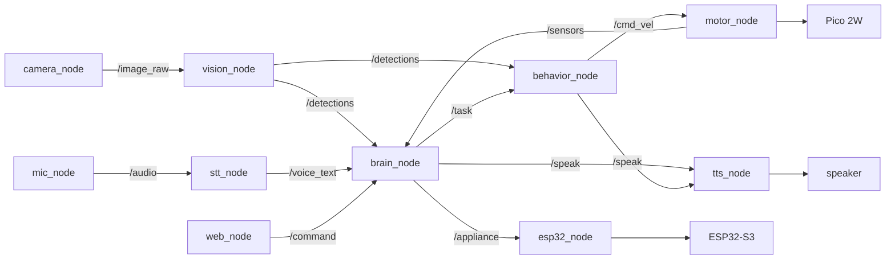

# Sahayak — ROS 2 Node Graph Design

**Version:** 1.0 · **Date:** 2026-07-08

**Hardware:** RDK X5 — 8x Cortex-A55, 10 TOPS BPU, 4 GB RAM

This document specifies the ROS 2 architecture design for Sahayak: node names, topics/services/actions, message types, and approximate rates. It maps to the robot's implemented behaviors (motor control, BPU vision, offline STT/TTS, command routing, and autonomous modes Guard/Patrol/Follow/Find/RoomCheck).

## Node graph

## Node specifications

| Node | Subscribes | Publishes | Purpose |

|---|---|---|---|

| camera_node | - | /image_raw | Pulls frames from OPPO F27 IP webcam |

| vision_node | /image_raw | /detections | YOLOv8 inference on BPU |

| mic_node | - | /audio | Captures mic audio on request |

| stt_node | /audio | /voice_text | Whisper offline transcription |

| tts_node | /speak | - | Piper offline speech |

| motor_node | /cmd_vel | /sensors | Pico serial: drive + sensors + watchdog |

| brain_node | /voice_text, /command, /detections, /sensors | /task, /speak, /appliance | Command router (keywords + Gemma) |

| behavior_node | /task, /detections, /sensors | /cmd_vel, /speak | Guard/Patrol/Follow/Find/RoomCheck |

| web_node | - | /command | Bridges web remote into ROS 2 |

| esp32_node | /appliance | - | WiFi HTTP to ESP32 lights |

## Topics, message types, approximate rates

| Topic | Message type | Approx rate |

|---|---|---|

| /image_raw | sensor_msgs/Image | ~6 Hz |

| /detections | vision_msgs/Detection2DArray | ~5.7 Hz |

| /audio | audio_common_msgs/AudioData | on demand |

| /voice_text | std_msgs/String | on command |

| /command | std_msgs/String | event-driven |

| /task | std_msgs/String | event-driven |

| /speak | std_msgs/String | event-driven |

| /cmd_vel | geometry_msgs/Twist | 3-5 Hz (feeds 0.6 s watchdog) |

| /sensors | sensor_msgs/Range + custom Environment | ~2 Hz |

| /appliance | std_msgs/String | event-driven |

## Actions and services

- Action RunMode (behavior_node): goal = mode name + optional target; feedback = status; result = report. Fits long-running cancelable modes.

- Service Stop (behavior_node): immediate cancel, publishes zero /cmd_vel.

## QoS design

| Data | QoS | Why |

|---|---|---|

| /image_raw, /detections, /sensors | Best-effort, depth 1 | latest-value sensor streams |

| /cmd_vel, /task, /command, /speak | Reliable, depth 10 | commands must not be lost |

The /cmd_vel to motor_node path publishes at 3-5 Hz to stay under the Pico's 0.6 s safety-watchdog timeout.

